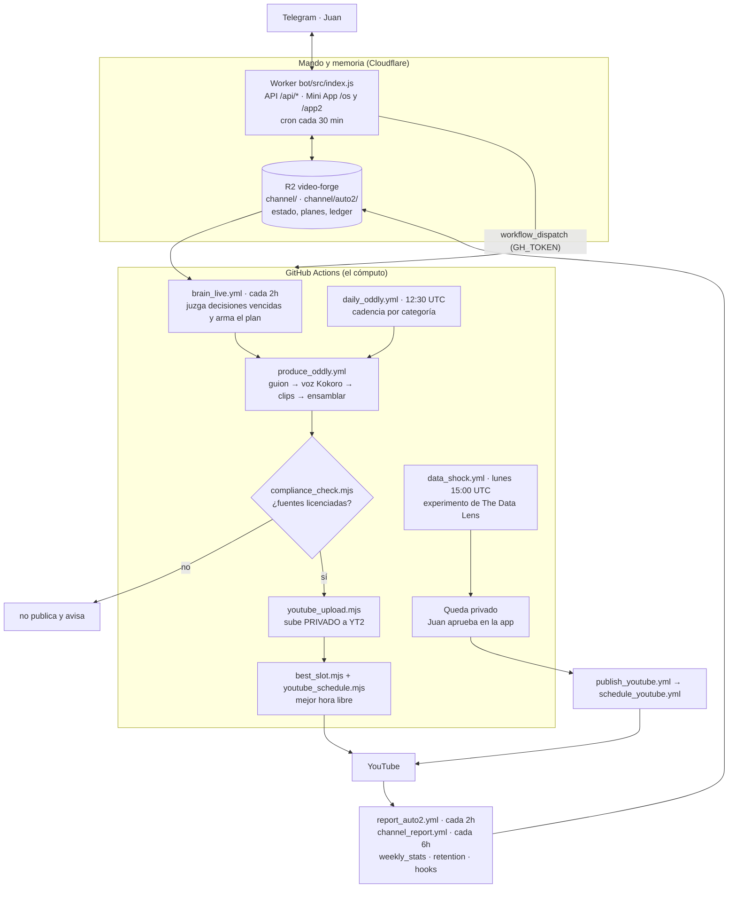

# video-forge

Fábrica de videos de YouTube que se opera sola en la nube: escribe el guion, narra, renderiza, sube y programa, para dos canales independientes.

[](https://github.com/juanberrio0399/video-forge/actions/workflows/tests.yml)
[](https://github.com)
[](https://github.com)
[](LICENSE)

## Qué es y qué problema resuelve

Publicar en YouTube con cadencia exige un equipo (guion, voz, edición, SEO, agendado) o una
suscripción mensual a herramientas de render. Este repo hace ese trabajo con infraestructura que
no cuesta nada: **GitHub Actions es el CPU, un Cloudflare Worker + R2 son el mando y la memoria, y
Telegram es la interfaz**. Nada se renderiza en un PC y no hay servidor que mantener.

El sistema no solo produce: **mide lo que publica y decide qué producir después**. Cada pieza queda
registrada como una decisión con su métrica y su criterio de éxito, y un ciclo que corre cada 2 horas
la juzga después contra ese criterio.

Alimenta dos canales reales:

- **[The Data Lens](https://www.youtube.com/@TheDataLensHQ)** (`@TheDataLensHQ`) — datos y dinero,
  faceless, en inglés, mercado EE.UU. Producción guiada: el video queda privado y se aprueba a mano.
- **[Oddly Loop](https://www.youtube.com/@oddlyloophq)** (`@oddlyloophq`) — ASMR, satisfying y
  compilaciones con fuentes licenciadas. Full-auto: produce, verifica licencias y se programa solo.

Los dos canales están **separados de punta a punta**: estado, credenciales, reportes y agendado. Nunca
comparten datos.

## Cómo funciona



Paso a paso, el ciclo de Oddly Loop (el que corre sin intervención):

1. **Decidir.** `brain_live.yml` corre cada 2 horas. Lee de R2 lo que el sistema ya sabe, revisa las
   decisiones cuyo plazo venció contra su propio criterio (`pipeline/lib/ledger.mjs`), y arma el plan
   de hoy y mañana con `pipeline/lib/lineup.mjs`. Cada pieza del plan lleva decisión, razón, evidencia,
   métrica, plazo y criterio. Produce con horas de anticipación, máximo 3 piezas por ciclo.
2. **Producir.** `produce_oddly.yml` escribe el guion (`compilation_script.mjs`, con Gemini y las
   reglas de retención del nicho), genera la voz con Kokoro si la variante es narrada, baja la
   biblioteca de sonido ASMR desde R2 y ensambla con `build_compilation.mjs`: clips de Pexels/Pixabay,
   mezcla de sonido por nicho, grade cinematográfico y subtítulos.
3. **Verificar licencias.** `compliance_check.mjs` es una puerta dura: si un clip no viene de la lista
   blanca de `channel/auto2/sources.seed.json` o la pieza no es transformadora, no se publica y avisa.
4. **Subir y programar.** `youtube_upload.mjs` sube **privado** con las credenciales `YT2_*` y declara
   `containsSyntheticMedia: true`. `best_slot.mjs` elige la siguiente franja libre a partir de
   `best_hours.json` (las horas que más rinden según los datos del propio canal), con tope de 2 por hora.
5. **Medir.** `report_auto2.yml` (cada 2h) y la cadena diaria de análisis (`weekly_stats` → `channel_brain`
   → `episodes` → `hypotheses` → `retention` → `monetization_report` → `hooks` → `alerts`) escriben las
   métricas en R2. Ese estado es lo que lee el cerebro en el paso 1 y lo que muestra la Mini App.

The Data Lens sigue el mismo esqueleto pero **con aprobación humana**: el video queda privado, Juan lo
aprueba desde la app y ahí sí corren `publish_youtube.yml` (SEO + miniatura) y `schedule_youtube.yml`.

## Estructura del repo

| Carpeta / archivo | Qué vive ahí |
|---|---|
| `pipeline/*.mjs`, `*.py` | Los ~130 scripts de la fábrica: guion, voz, ensamblaje, YouTube, reportes, cerebro, radar. Cada uno abre con un comentario de qué hace y cuándo corre. |
| `pipeline/lib/` | Lógica **pura** (sin red ni disco): ranking de nichos, scoring, ledger, lineup, ypp, alertas. Es lo que cubren los tests. |
| `.github/workflows/` | Los 85 workflows. Un workflow por paso; se encadenan con `workflow_dispatch` usando el PAT. |
| `bot/` | Cloudflare Worker: API `/api/*`, Mini App de Telegram (`/app`, `/app2`, `/os`) y el cron de 30 min que compensa los crons que GitHub se salta. |
| `radar-bot/` | Worker aparte: Mini App del radar de mejoras (ejecutar → revisar → merge de PRs). |
| `shared/` | Componentes de UI compartidos entre los bots del AI OS (shell, tokens, vista unificada). |
| `channel/` | Semillas del estado de The Data Lens (`*.seed.json`, `direction.json`). El estado vivo está en R2. |
| `channel/auto2/` | Semillas de Oddly Loop: cadencia, lista blanca de fuentes, nichos, branding. |
| `tests/` | 30 suites de vitest sobre `pipeline/lib/` y el contrato del OS. |
| `clipper/` | Puente **local** (no nube): recorta videos CC-BY de YouTube para Oddly Loop. Se corre a mano en el PC. |
| `skills/` | Notas de oficio por área (guion, voz, SEO, shorts, monetización) que alimentan los prompts. |
| `projects/`, `index.html`, `meta.json`, `hyperframes.json` | Composición HyperFrames del canal principal (HTML → MP4). |
| `assets/luts/` | LUT de grade cinematográfico que aplica el ensamblador. |
| `docs/` | Un documento por tema (ver la tabla al final). |

## Cómo correrlo

Los tests y los chequeos de sintaxis corren en cualquier máquina con Node 22:

```bash
npm install          # instala vitest (única dependencia de desarrollo)
npm test             # las 30 suites de pipeline/lib (tests.yml corre esto en cada PR)
npx vitest run tests/ledger.test.mjs   # una sola suite
node --check pipeline/brain_live.mjs   # lo que valida build-check.yml
```

La composición del canal principal usa el CLI de HyperFrames, con la versión clavada en `package.json`
para que el video vuelva a renderizar igual meses después:

```bash
npm run check        # lint + runtime + layout de la composición
npm run dev          # servidor de preview (queda corriendo)
npm run render       # renderiza a MP4
```

La fábrica en sí **no se corre en local**: se dispara por workflow.

```bash
gh workflow run brain_live.yml                      # un ciclo del cerebro
gh workflow run produce_oddly.yml -f niche=satisfying -f kind=short
gh workflow run deploy-bot.yml                      # despliega el Worker (wrangler corre en Actions)
gh run watch                                        # seguir la corrida
```

### Secretos y variables

En **GitHub → Settings → Secrets and variables → Actions** (solo nombres; los valores nunca van al repo):

| Secreto | Para qué |
|---|---|
| `YT_CLIENT_ID`, `YT_CLIENT_SECRET`, `YT_REFRESH_TOKEN` | OAuth de The Data Lens. |
| `YT2_CLIENT_ID`, `YT2_CLIENT_SECRET`, `YT2_REFRESH_TOKEN` | OAuth de Oddly Loop (ver `docs/SEGUNDO_CANAL_OAUTH.md`). |
| `GEMINI_API_KEY`, `GEMINI_API_KEY2` | Guion, SEO y análisis. Dos llaves para repartir la cuota gratis. |
| `PEXELS_API_KEY`, `PIXABAY_API_KEY` | Footage con licencia. |
| `FREESOUND_API_KEY` | Biblioteca de sonido CC0. |
| `CLOUDFLARE_API_TOKEN`, `CLOUDFLARE_ACCOUNT_ID` | Desplegar el Worker y leer/escribir R2. |
| `GH_TOKEN` | PAT fine-grained (Actions: read/write) para que un workflow encadene al siguiente y el Worker dispare la fábrica. |
| `TELEGRAM_BOT_TOKEN`, `OWNER_CHAT_ID` | Avisos al chat. |
| `CEREBRAS_API_KEY`, `GROQ_API_KEY`, `SAMBANOVA_API_KEY`, `OPENROUTER_API_KEY` | Opcionales. `pipeline/llm.mjs` los usa como relevo cuando Gemini se queda sin cuota; los que no tengan llave se saltan solos. |
| `BILIBILI_COOKIE` | Repost de Shorts (opcional). |

En el Worker, con `wrangler secret put`: `TELEGRAM_BOT_TOKEN`, `TELEGRAM_WEBHOOK_SECRET`,
`OWNER_CHAT_ID`, `GH_TOKEN`. Los bindings (R2, AI, servicios) están en `bot/wrangler.toml`.
Los pasos completos de alta del bot están en [`bot/README.md`](bot/README.md).

## Decisiones y límites

- **GitHub Actions como granja de render, no un servidor.** Un runner gratis no aguanta un video de
  10 minutos de una sentada, así que `render_phased.yml` parte la narración en fases de ~2 minutos,
  las renderiza en paralelo, cada una pasa su propia puerta de calidad y al final se unen. Alquilar
  una GPU sería más simple y costaría dinero todos los meses; esto no cuesta nada.
- **El repo es público a propósito.** En privado, los 2.000 minutos mensuales de Actions se agotaban y
  todos los workflows fallaban. Público, los minutos son ilimitados. La contrapartida es que **nada
  sensible puede vivir en el repo**: la voz de referencia está en R2 privado y `.gitignore` bloquea
  `assets/voice/*.mp3`.
- **Kokoro para la voz, no edge-tts.** Kokoro es Apache-2.0 y corre en CPU dentro del runner. edge-tts
  es zona gris para uso comercial y depende de un servicio que puede cerrar; Coqui/XTTS tienen licencia
  no comercial.
- **Cadena de proveedores de texto, no uno solo.** `pipeline/llm.mjs` prueba en orden Gemini →
  Cerebras → Groq → Workers AI → SambaNova → OpenRouter → GitHub Models y usa el primero que responda.
  Todos tienen capa gratis; quedarse con uno significa parar la fábrica el día que se agota su cuota.
- **R2 como memoria, no una base de datos.** El estado son archivos JSON por canal. Sin servidor de
  base de datos que mantener y el Worker lee directo. El costo: no hay consultas — quien necesite
  cruzar datos los cruza en el script.
- **Una puerta legal antes de publicar, no después.** `compliance_check.mjs` bloquea la publicación si
  un clip no está en la lista blanca de fuentes. Es más lento que publicar y arreglar después, pero un
  strike de copyright cuesta el canal.
- **Toda subida declara `containsSyntheticMedia: true`.** La voz es sintética; ocultarlo pone en riesgo
  la monetización.
- **Lo que el proyecto deliberadamente NO hace:** no compra vistas ni suscriptores, no comenta ni manda
  DM en canales ajenos, no re-sube material de terceros sin licencia ni transformación, y no publica en
  TikTok automáticamente (su Content Posting API exige una app aprobada). Tampoco corre rutinas en la
  nube de ningún asistente: todo el agendado vive en crons de GitHub Actions.

## Operación

### Lo que corre solo

| Cuándo | Workflow | Qué hace |
|---|---|---|
| Cada 30 min | cron del Worker (`bot/wrangler.toml`) | Dispara el Orchestrator y, en horas pares, el cerebro. GitHub se salta crons frecuentes; este reloj lo compensa. |
| Cada 2 h | `brain_live.yml`, `report_auto2.yml` | Decide y produce Oddly Loop; refresca sus métricas. |
| Cada 6 h | `channel_report.yml`, `comment_reply.yml`, `telegram_broadcast.yml`, `schedule_backlog_*.yml` | Estado de The Data Lens, respuestas a comentarios, difusión y re-agendado de lo que falló. |
| Diario | `weekly_stats` (12:45) → `channel_brain` (13:00) → `episodes` (14:00) → `hypotheses` (14:30) → `retention` (15:00) → `monetization_report` (15:30) → `hooks` (16:00) → `alerts` (16:30) UTC | La cadena de medición. Cada paso corre después del que le da insumos. |
| Diario 11:00 UTC | `watchdog.yml` | Verifica R2, los tokens de los dos canales y que los crons de producción sigan vivos. Solo avisa si algo falla. |
| Diario 12:30 UTC | `daily_oddly.yml` | Cadencia por categoría de Oddly Loop. |
| Lunes | `radar_scan` (13:00), `niche_radar` (11:00), `oddly_niche_review` (14:00), `data_shock` (15:00), `codeql` (06:00) | Radar de mejoras, revisión de nichos, el experimento semanal de The Data Lens y el barrido de seguridad. |
| Domingo | `growth_radar` (13:00), `experiment_report` (17:00), `cross_validate` (18:00) | Investigación externa, reporte de experimentos y cruce de lo que dice la investigación contra los datos propios. |

### Dónde mirar cuando algo falla

1. **Telegram** es la primera señal: el watchdog y las alertas avisan ahí, en silencio entre 11pm y
   5am Bogotá (`pipeline/notify_telegram.sh`).
2. **Actions** guarda el log completo de cada paso: `gh run list --workflow=<archivo>.yml` y
   `gh run view <id> --log-failed`.
3. **La Mini App** (`/app2`) muestra qué está corriendo, la bitácora del cerebro y el ledger de
   decisiones con sus aciertos y fallos.
4. **R2** tiene el estado crudo: `channel/tools_health.json` dice qué herramienta está caída y
   `channel/error_log.json` guarda causa y arreglo de los fallos anteriores (`error_learn.mjs`).

Fallos conocidos y su manejo están en [`docs/CONFIABILIDAD_24_7.md`](docs/CONFIABILIDAD_24_7.md): el
sistema reanuda renders caídos, salta un tema que falla 3 veces y corta el circuito antes de entrar en
bucle.

## Estado actual y siguientes pasos

**Funcionando hoy**

- Oddly Loop produce, verifica licencias, sube y se programa sin intervención, guiado por `brain_live`.
- Puerta de compliance, agendado por datos propios, biblioteca de sonido CC0 y grade por nicho.
- Auto-recuperación: watchdog, reintentos entre workflows, cortacircuitos y re-agendado del backlog.
- 30 suites de tests sobre la lógica de decisión, más CodeQL y Dependabot en cada PR.
- El AI OS (Pulse · Trabajo · Decisiones) unifica en Telegram este repo con Radar y Viento.

**A medias**

- **The Data Lens está pausado desde el 2026-09-14**: diez semanas sin tracción. `daily_video.yml` y
  `history_short.yml` quedaron en disparo manual y solo sigue `data_shock.yml` los lunes. Se revisa a
  los 21 días; si un experimento pasa 500 vistas a los 7 días se reanuda ese formato (registrado en el
  ledger como `channel_pause`).
- La meta de monetización de Oddly Loop por Shorts es **improbable al ritmo actual**: el requisito son
  ~111 mil vistas/día y el canal va por ~15.500 a la semana. El detalle está en
  [`docs/AUDITORIA_CEREBRO.md`](docs/AUDITORIA_CEREBRO.md).
- Fases 4 y 5 del AI OS (Radar y Viento completos dentro del OS), en
  [`docs/AI_OS_FASES.md`](docs/AI_OS_FASES.md).
- Distribución multiplataforma: Telegram y Pinterest están en código pero sin credenciales
  ([`docs/DISTRIBUTION.md`](docs/DISTRIBUTION.md)).

**Ideas con issue abierto** (las levanta `radar_scan.yml` los lunes)

- [#121](https://github.com/juanberrio0399/video-forge/issues/121) — migrar la autenticación de
  Google/YouTube a OIDC y dejar de rotar refresh tokens.
- [#122](https://github.com/juanberrio0399/video-forge/issues/122) — orquestar el estado con Cloudflare
  Workflows en vez de encadenar workflows con el PAT.
- [#133](https://github.com/juanberrio0399/video-forge/issues/133) — firmar los videos con Content
  Credentials (C2PA).
- [#123](https://github.com/juanberrio0399/video-forge/issues/123) — panel público del estado de la
  fábrica.

## Documentación

| Doc | Qué contiene |
|---|---|
| [docs/ARQUITECTURA.md](docs/ARQUITECTURA.md) | Componentes, el slot de producción, el estado en R2 y la auto-recuperación. |
| [docs/FLUJOS.md](docs/FLUJOS.md) | Los flujos con diagramas: producción de cada canal, agendado, estado, sonido. |
| [docs/AUDITORIA_CEREBRO.md](docs/AUDITORIA_CEREBRO.md) | Qué medía mal el cerebro, qué se corrigió y cómo se juzga a sí mismo. |
| [docs/CANAL_AUTOMATICO.md](docs/CANAL_AUTOMATICO.md) | Diseño de Oddly Loop: nichos, fuentes legales, fases. |
| [docs/EXPERTO_POR_CATEGORIA.md](docs/EXPERTO_POR_CATEGORIA.md) | Cómo se trabaja una categoría nueva y las reglas de retención. |
| [docs/BRANDING.md](docs/BRANDING.md) | Tipografía, paletas e identidad de canales, bots y Mini Apps. |
| [docs/CONFIABILIDAD_24_7.md](docs/CONFIABILIDAD_24_7.md) | Mapa de fallos y cómo se cierran. |
| [docs/CAPACIDAD_Y_EXPERIMENTOS.md](docs/CAPACIDAD_Y_EXPERIMENTOS.md) | Cuánto puede publicar la fábrica y la rampa de duración. |
| [docs/CRECIMIENTO.md](docs/CRECIMIENTO.md) | Palancas de suscriptores: encadenar videos, CTA, tono. |
| [docs/GROWTH_ROADMAP.md](docs/GROWTH_ROADMAP.md) | Sistema de crecimiento por fases (score, A/B, alertas, cruce). |
| [docs/AI_OS_FASES.md](docs/AI_OS_FASES.md) | Fases del AI OS y lo que queda abierto. |
| [docs/DISTRIBUTION.md](docs/DISTRIBUTION.md) | Reparto de Shorts a otras superficies y qué está bloqueado. |
| [docs/DIFUSION.md](docs/DIFUSION.md) | Material de lanzamiento del repo, listo para publicar a mano. |
| [docs/SEGUNDO_CANAL_OAUTH.md](docs/SEGUNDO_CANAL_OAUTH.md) | Crear el 2º canal y sacar sus credenciales `YT2_*`. |
| [docs/miniapp-historias-video-forge.md](docs/miniapp-historias-video-forge.md) | Historias de usuario de la Mini App, mapeadas al código. |
| [docs/miniapp-historias-radar-bot.md](docs/miniapp-historias-radar-bot.md) | Lo mismo para el radar-bot. |

## Licencia

Apache-2.0 — © 2025 Juan Berrio. Ver [LICENSE](LICENSE) y [NOTICE](NOTICE).

Topics del repo: `youtube-automation`, `faceless-youtube`, `serverless`, `github-actions`,
`cloudflare-workers`, `text-to-speech`, `generative-ai`, `gemini`, `content-automation`,
`video-generation`, `ffmpeg`, `telegram-bot`, `automation`, `r2`.
