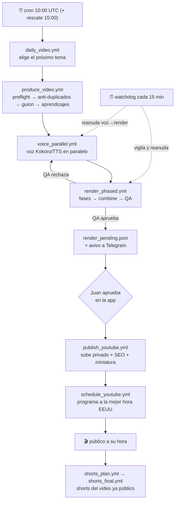

# Arquitectura — video-forge

Fábrica **100% en la nube** de videos de YouTube para el canal **The Data Lens** (`@TheDataLensHQ`): datos/dinero, faceless, en inglés, mercado EE.UU. Todo con herramientas **gratis**. Semi-automática: el sistema produce solo; Juan aprueba desde una Telegram Mini App y el sistema programa a la mejor hora.

## Componentes

| Componente | Rol |
|---|---|
| **GitHub Actions** | El cómputo: escribe guion, genera voz, renderiza, sube a YouTube. Cada paso es un workflow. |
| **Cloudflare Worker** (`bot/src/`) | Mando y control: sirve la Mini App y la API `/api/*`, guarda el estado en R2 y dispara workflows. |
| **Cloudflare R2** | Almacenamiento y estado: guiones, audio, video, miniaturas y todos los JSON de estado del canal. |
| **Telegram Mini App** | La interfaz de Juan: ver el canal, aprobar/programar, sugerir shorts, subir fotos/recetas. |
| **YouTube Data API** | El destino: subir, programar (`publishAt`), fijar miniatura, leer métricas. |

## Flujo de producción (end-to-end)

**En una frase:** un cron elige el tema → se escribe el guion → se genera la voz → se renderiza por fases con control de calidad → queda pendiente de aprobación → Juan aprueba en la app → se sube y se programa a la mejor hora → al publicarse, se pueden hacer sus shorts. El **watchdog** vigila todo cada 15 min y reanuda lo que se caiga.

## El "slot" activo

Hay **un único slot de producción a la vez**: `0001-youtube-money` en R2. Solo se produce un video al tiempo (voz + render + aprobación) para no pisar insumos ni encimar trabajo. Las guardas de `daily_video` (¿hay `render_pending`? ¿hay producción en curso?) impiden arrancar un segundo mientras el slot está ocupado.

## Estado en R2

| Archivo | Qué guarda |
|---|---|
| `channel/state.json` | Cola de ideas (≥10 por delante), datos del canal, cadencia. |
| `channel/produced.json` | Qué N ya se **publicaron** (se marca al PUBLICAR, no antes — evita huecos). |
| `channel/active_n.json` | El N + tema del video en el slot activo (para cerrar el ciclo al publicar). |
| `channel/attempts.json` | Intentos por N (anti-limbo: salta un tema tras 3 intentos fallidos). |
| `channel/scheduled_local.json` | Programaciones recién hechas (antes de que YouTube confirme el `publishAt`). |
| `channel/shorts_map.json` | Mapeo short → video padre (para el árbol de la app). |
| `channel/voice_choice.json` | Motor de voz elegido (Kokoro / TTS). |
| `channel/inventory_cache.json` | Inventario real del canal (largos/shorts + vistas + miniaturas), cacheado 10 min. |
| `channel/hidden_videos.json` | Videos ocultos de la app (duplicados retirados). |
| `channel/tools_health.json`, `learnings.json`, `craft_feedback.json` | Salud de herramientas y aprendizajes que se aplican al próximo video. |
| `video/0001-youtube-money/render_pending.json` | Marca "video listo, esperando aprobación" (con nota QA). |
| `video/0001-youtube-money/seo_approved.json`, `video_id.txt`, `package.json` | Estado de aprobación/publicación del video del slot. |

## Crons y automatización

| Qué | Cuándo | Automático |
|---|---|---|
| `daily_video.yml` | 10:00 UTC + **15:00 UTC (rescate)** | ✅ sin intervención |
| `watchdog.yml` | cada 15 min | ✅ vigila y reanuda |
| Todo lo demás (publicar, programar, shorts, SEO, miniatura) | disparado por la app/Juan o encadenado por otro workflow | semi-auto |

La parte **100% desatendida** llega hasta *dejar un video pendiente de aprobar*. Publicar y programar es **semi-automático**: Juan aprueba con un toque y el sistema pone la mejor hora (ver [HISTORIAS_USUARIO.md](HISTORIAS_USUARIO.md)).

## Auto-recuperación (nunca queda en limbo)

- **`preflight.mjs`** — antes de producir valida que las herramientas críticas (Gemini, Kokoro, YouTube) respondan; si algo crítico está caído, **aborta** y avisa (no arranca con errores).
- **`watchdog.mjs`** — cada 15 min: cancela corridas colgadas (>140 min) y **reanuda el render** si se detuvo (falló, se canceló o "voz lista sin render"). Ventana de rescate 6 h. Cortacircuitos: máx. 3 fallos / 5 renders en 2 h (nunca loop).
- **QA (`qa_check.mjs`)** — rechaza videos cortos/mudos/corruptos y regenera; la nota es *advisory* (no bloquea por un fallo de visión). Tope de intentos + cortacircuitos.
- **Anti-limbo** — un tema que falla 3 veces se **salta** para no trancar la cola.
- **Reintentos** — los disparos entre workflows (daily→produce, guion→voz, regen→voz) reintentan 4 veces (un blip del API de GitHub no rompe la cadena).

## Convención clave

**"Producido" se marca solo al PUBLICAR**, no al escribir el guion. Así, si un render se cae y nunca se publica, ese N no queda marcado como hecho → el sistema lo reintenta en vez de dejar un hueco fantasma. (Ver el mapa completo en [CONFIABILIDAD_24_7.md](CONFIABILIDAD_24_7.md).)

*Documento vivo — actualizar cuando cambie el flujo.*
