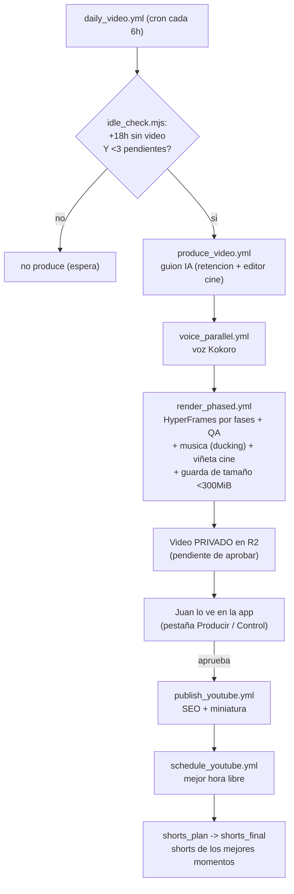
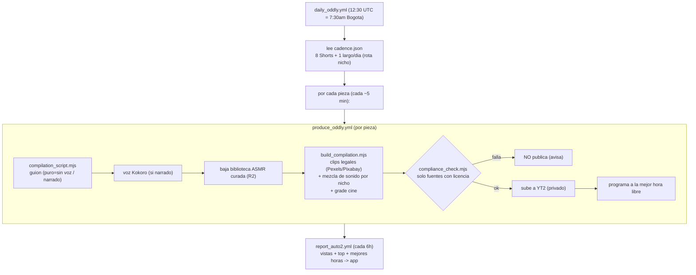
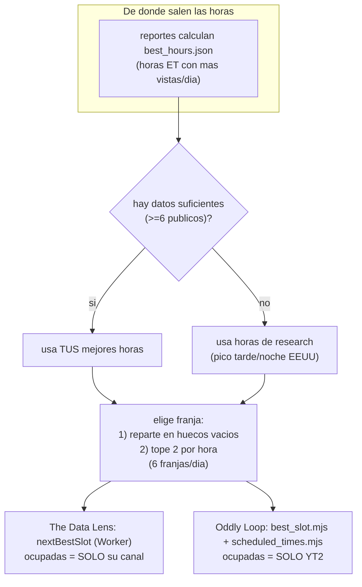
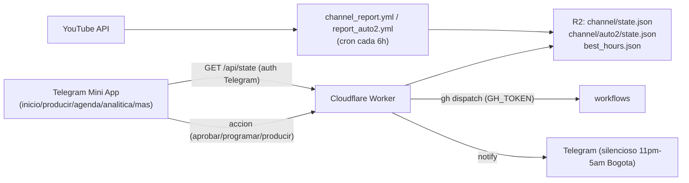
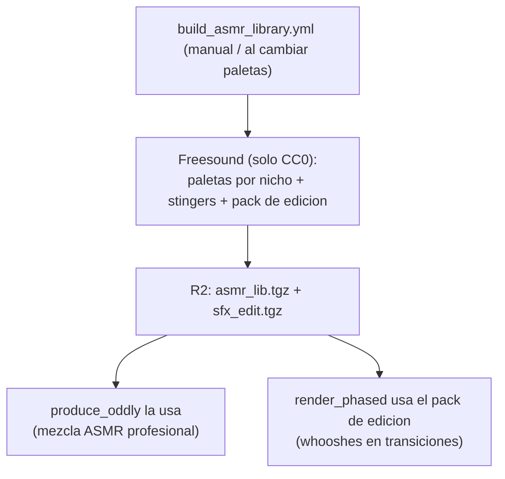
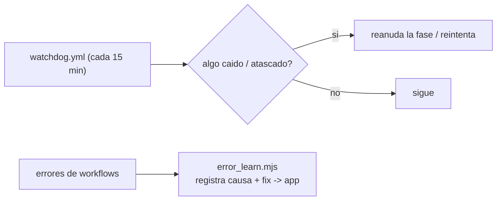

# Flujos de video-forge

Todos los flujos del sistema, con diagramas. Dos canales **independientes** (nunca comparten datos).
Los diagramas se renderizan en GitHub.

---

## 1) The Data Lens — producción por INACTIVIDAD (Juan aprueba)

---

## 2) Oddly Loop — BLITZ de Shorts (full-auto)

---

## 3) Agendado (por DATOS) — separado por canal

---

## 4) Estado y control (app <-> nube)

---

## 5) Biblioteca de sonido ASMR (curada, CC0)

---

## 6) Auto-recuperacion (24/7)

---

## Resumen de cadencia

| Canal | Cuando | Que produce |
|---|---|---|
| The Data Lens | cada 6h, si +18h inactivo | 1 largo (privado, Juan aprueba); shorts del video |
| Oddly Loop | 12:30 UTC diario | 8 Shorts + 1 largo (full-auto, se programan solos) |
| Reportes | cada 6h | refrescan vistas/top/mejores-horas |
| Watchdog | cada 15 min | reanuda lo caido |
