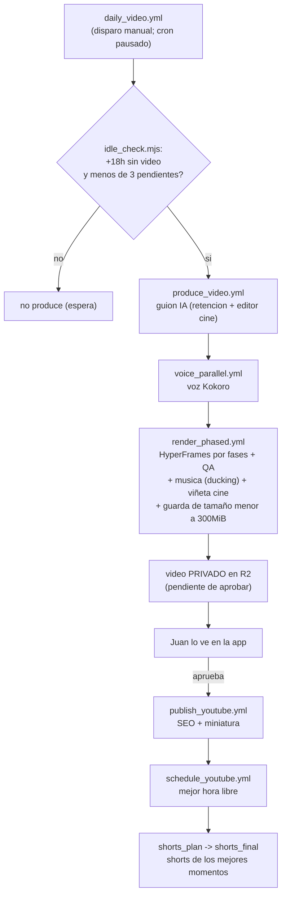
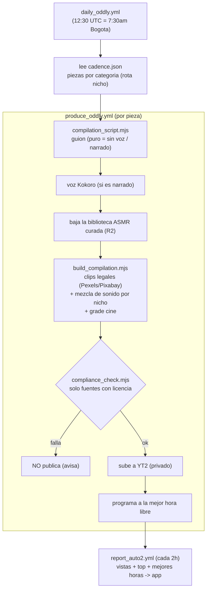
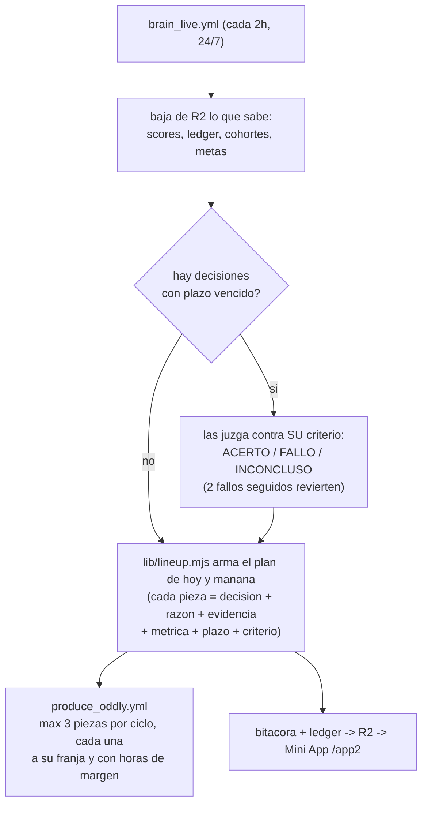
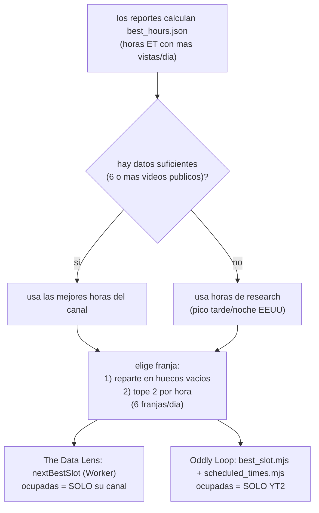
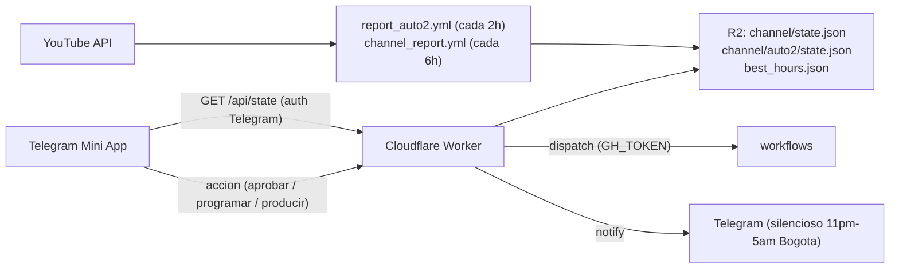
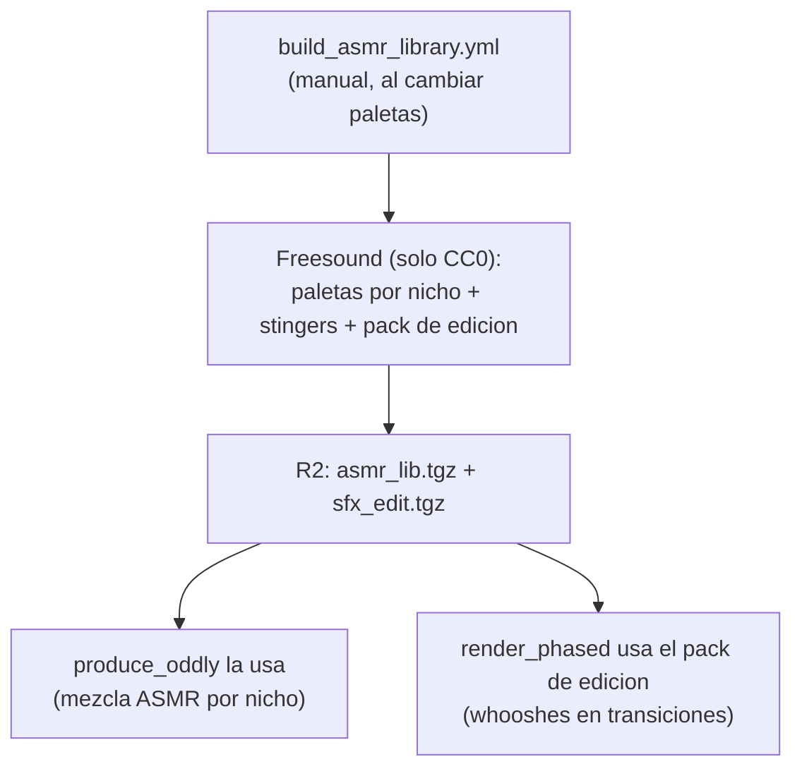
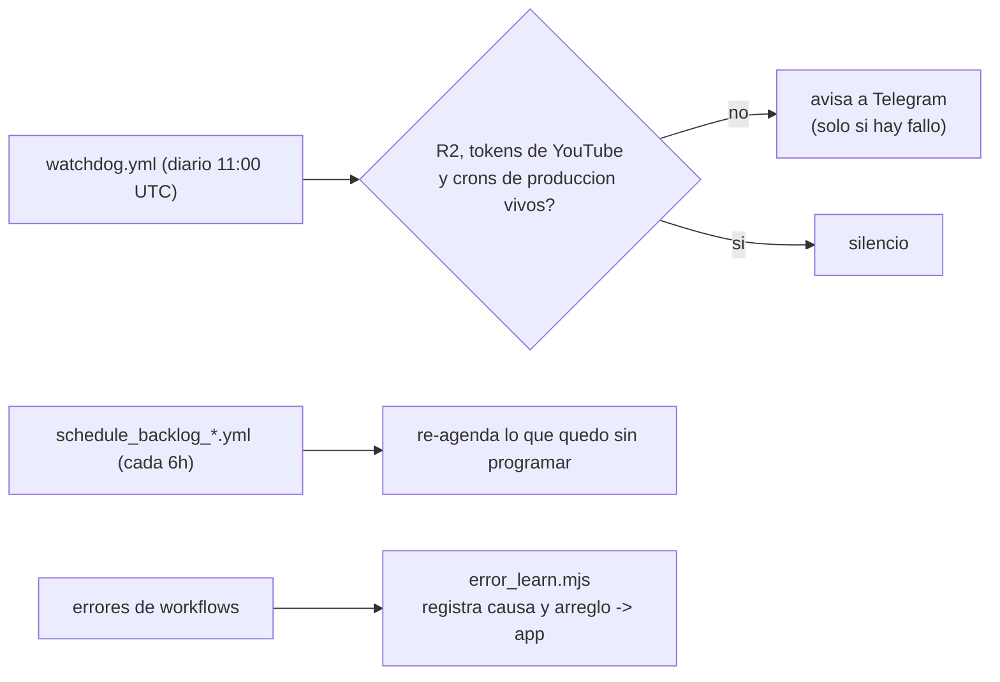

# Flujos de video-forge

Todos los flujos del sistema, con diagramas (GitHub los renderiza). Los dos canales son
**independientes**: nunca comparten estado, credenciales ni reportes.

---

## 1) The Data Lens — producción por INACTIVIDAD (Juan aprueba)

> **Pausado desde el 2026-09-14.** El cron de `daily_video.yml` está apagado y el flujo solo arranca a
> mano. Queda documentado porque el encadenado no cambió: al restaurar el cron vuelve a correr tal cual.

---

## 2) Oddly Loop — produccion full-auto por pieza

---

## 3) El cerebro decide que se produce (Oddly Loop)

Desde la auditoria de septiembre-2026 la tanda de las 12:30 UTC ya no fabrica narrados
(`LINEUP_MODE=on`): quien decide es `brain_live.yml`, cada 2 horas.

---

## 4) Agendado (por DATOS) — separado por canal

---

## 5) Estado y control (app y nube)

---

## 6) Biblioteca de sonido ASMR (curada, CC0)

---

## 7) Vigilancia y auto-sanado

---

## Resumen de cadencia

| Canal | Cuando | Que produce |
|---|---|---|
| The Data Lens | pausado; solo `data_shock.yml` los lunes 15:00 UTC | 1 experimento semanal (privado, Juan aprueba) |
| Oddly Loop | `brain_live.yml` cada 2h + `daily_oddly.yml` 12:30 UTC | las piezas del plan del cerebro (se programan solas) |
| Reportes | Oddly cada 2h · Data Lens cada 6h | refrescan vistas, top y mejores horas |
| Watchdog | diario 11:00 UTC | avisa si R2, los tokens o los crons se cayeron |
