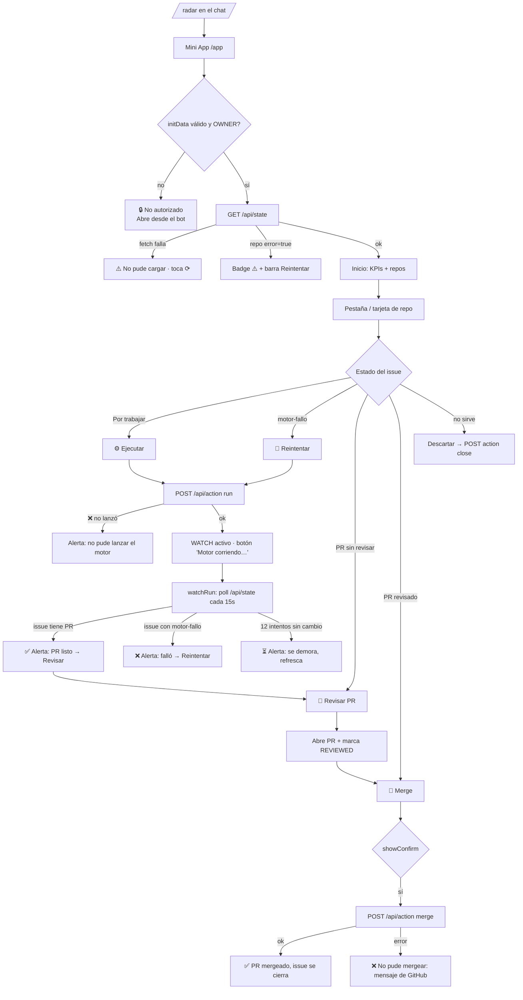

# Mini App — Radar Bot

> Fuente de verdad: `radar-bot/src/index.js` (Worker + Mini App en un solo archivo).
> Todo lo que sigue está tomado del código real; se cita `archivo:función` en cada punto.

## 1. Propósito y quién lo usa

Panel de Telegram para vigilar los repos de Juan y gobernar el "radar" de mejoras.
Muestra los Issues con etiqueta `radar` por repo, y conduce cada hallazgo por el flujo
**⚙️ Ejecutar → 👀 Revisar → 🔀 Merge** sin salir del celular. El motor central
(`juanberrio0399/video-forge`, workflow `radar_implement.yml`) implementa en el repo objetivo
usando el PAT.

- **Único usuario:** Juan (dueño). Auth por `initData` de Telegram (HMAC con el token del bot)
  y verificación contra `OWNER_CHAT_ID` — `index.js:validInit`, `index.js:ownerFromReq`. Nadie más entra.

## 2. Historias de usuario

Todas corresponden a capacidades presentes en el código.

1. Como dueño quiero **abrir el Radar desde el bot** (`/radar` → botón `web_app`) para no depender del PC — `index.js` webhook (`fetch`, rama `/webhook`).
2. Como dueño quiero **ver un Inicio con KPIs** (total de mejoras, alta prioridad, por-merge, fallos) para saber de un vistazo qué pesa — `index.js:homeView`.
3. Como dueño quiero **pestañas por repo con badge** (nº de PRs listos) para saltar directo al repo con trabajo — `index.js:tabsHtml`.
4. Como dueño quiero **ver cada repo con conteo por prioridad** (alta/media/baja/sin) y filtrar tocando un chip, para atacar primero lo alto — `index.js:homeView`, `index.js:repoView`, `go()`.
5. Como dueño quiero que los issues se **agrupen por estado** (❌ Falló el motor, 🔧 Pendientes por merge, 🆕 Por trabajar) para entender en qué punto está cada uno — `index.js:repoView`.
6. Como dueño quiero **lanzar el motor** sobre un issue (⚙️ Ejecutar / 🔁 Reintentar si falló antes) para que genere el PR — `index.js:runAct`, `doAction` (action `run`).
7. Como dueño quiero **que la app me avise cuando el motor termine** (PR listo ✅ o motor falló ❌) sin quedarme mirando — `index.js:watchRun` (poll cada 15 s hasta 12 intentos, con `TG.showAlert`).
8. Como dueño quiero **revisar el PR** antes de mergear (👀 Revisar abre el PR y marca "revisado") para no mergear a ciegas — `index.js` handler click `review`, estado en `localStorage` (`REVIEWED`).
9. Como dueño quiero **mergear (squash) solo tras revisar**, con confirmación, para cerrar el issue solo — `index.js:doAct`+`doAction` (action `merge`), `TG.showConfirm`.
10. Como dueño quiero **descartar** un issue que no me sirve (cierra el issue) — `doAction` (action `close`).
11. Como dueño quiero **abrir el issue o el PR en el navegador** (`TG.openLink`) para leer el detalle completo — handler click `open`.
12. Como dueño quiero **refrescar** manualmente y ver un skeleton mientras carga, para no quedar con datos viejos — `index.js:load`, `skeleton`.
13. Como dueño quiero **ver cuando GitHub no respondió** (badge ⚠️ y barra "No pude cargar este repo · Reintentar") para saber que el vacío es un fallo, no calma — `buildState` (`error:true`), `repoView` barra de error.
14. Como dueño quiero **ver los issues marcados `motor-fallo`** como "❌ El motor falló aquí — reintenta o impleméntalo manual", para no perder los que se rompieron — `buildState` (`err`), `issueCard`.

## 3. Mapa de flujo

## 4. Manejo de errores / procesos asíncronos

| Situación | ¿Qué ve el usuario hoy? | ¿Se le avisa? | Acción del usuario | Estado |
|---|---|---|---|---|
| Carga inicial (`/api/state`) en curso | Skeleton animado (`skeleton`) | Sí | Espera | OK |
| Fetch de estado falla (red) | Empty "⚠️ No pude cargar… toca ⟳" (`load` catch) | Sí | Reintenta con ⟳ | OK |
| Un repo no responde en GitHub (`error:true`) | Badge ⚠️ en Inicio + barra roja "No pude cargar este repo · Reintentar" en el repo | Sí | Reintenta | OK |
| initData inválido / no es el dueño | Empty "🔒 No autorizado — abre desde el bot" | Sí | Reabre desde el bot | OK |
| **Ejecutar el motor** (async 1-2 min) | Botón cambia a "⚙️ Motor corriendo… te aviso al terminar" + `watchRun` poll y alerta al final | Sí (poll + `showAlert`) | Espera; puede seguir usando la app | OK — este es el patrón de referencia |
| Motor termina OK (PR creado) | Alerta "✅ Listo #N: el PR quedó creado" | Sí | Revisa → Merge | OK |
| Motor falla (`motor-fallo`) | Alerta "❌ El motor falló en #N. Reintenta o hazlo a mano" + sección "❌ Falló el motor" | Sí | Reintenta o manual | OK |
| Motor tarda > 3 min (12 polls) | Alerta "⏳ se está demorando, refresca ⟳" y suelta el WATCH | Sí | Refresca luego | OK (ver gap G-R1) |
| `run` no se pudo lanzar (dispatch ❌) | Alerta con el mensaje "No pude lanzar el motor" | Sí | Reintenta | OK |
| Merge rechazado por GitHub (conflicto, checks) | Toast "❌ No pude mergear el PR #X: <mensaje de GitHub>" | Sí | Revisa el PR en GitHub | OK |
| No hay PR para el issue al mergear | Toast "🔎 No hay PR abierto para el #N" | Sí | — | OK |
| Estado vacío (sin issues, sin error) | Empty "✨ Sin novedades del radar… vuelve el lunes" | Sí | Espera al barrido | OK |
| WATCH se pierde si Juan cierra la Mini App | El poll vive solo en el WebView; al cerrar, no hay aviso | No | Reabrir y refrescar | GAP (G-R1) |

## 5. 🚨 Auditoría de "procesos invisibles"

Esta app es **la mejor de las tres** en visibilidad: el caso clásico (tras Ejecutar el motor
tarda 1-2 min) **ya está resuelto** con `watchRun` (poll cada 15 s + `showAlert` al terminar, con
tres desenlaces: PR listo, motor-fallo, o demora). Lo que queda:

- **G-R1 — El aviso del motor no sobrevive al cierre de la Mini App.**
  Dónde: `index.js:watchRun` / `runAct` (estado `WATCH` en memoria del WebView).
  Qué pasa: si Juan lanza el motor y **cierra** la app, `setInterval` muere; cuando vuelve a abrir
  ve el issue ya con PR (o con `motor-fallo`), pero **no recibe la alerta** de "listo/falló".
  Mejora: que el workflow `radar_implement.yml` mande un mensaje de Telegram al terminar
  (éxito/fallo), igual que hace video-forge con sus workflows. Así el aviso llega aunque el
  WebView esté cerrado. (El poll en la app sigue sirviendo para cuando está abierta.)

- **G-R2 — Tras 12 polls sin cambio, se abandona en silencio de fondo.**
  Dónde: `index.js:watchRun` (rama `tries>=12`).
  Qué pasa: avisa "se demora, refresca" y suelta el WATCH. Correcto, pero si el motor de verdad
  murió sin poner `motor-fallo` (p. ej. el runner se canceló), el issue queda "Por trabajar" y el
  único rastro es que no hay PR. No hay lectura del estado del run en GitHub Actions.
  Mejora (menor): consultar el `run` del dispatch y, si concluyó en `failure/cancelled`, mostrarlo
  como fallo aunque falte la etiqueta.

- **Bien resuelto (no es gap):** carga (`skeleton`), fetch fallido, repo caído, no-autorizado,
  merge rechazado y estados vacíos — todos avisan con texto claro y acción concreta.
