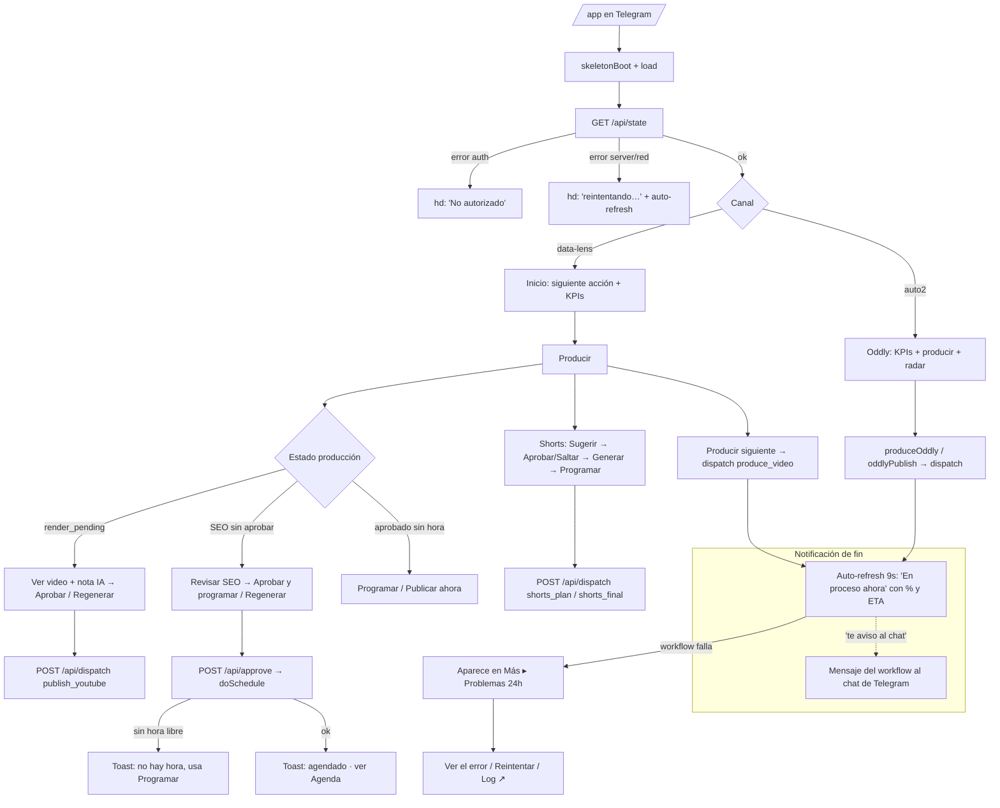

# Mini App — Video Forge (control de 2 canales de YouTube)

> Fuentes de verdad: cliente `bot/src/miniapp.js` (todo el HTML/JS de la Mini App) y
> servidor `bot/src/index.js` (Worker: `/app`, `handleApi`, dispatch a GitHub Actions).
> Todo lo documentado sale del código real; se cita `archivo:función`.

## 1. Propósito y quién lo usa

Centro de control en Telegram para **dos canales**: **The Data Lens** (`data-lens`, producción
guiada con calificación IA + SEO) y **Oddly Loop** (`auto2`, compilaciones ASMR/satisfying
full-auto). Desde el celular Juan produce, revisa, aprueba, agenda, publica, genera shorts y lee
analítica; cada acción dispara un workflow de GitHub Actions.

- **Único usuario:** Juan (dueño). Auth por `initData` (`index.js:validateInitData`) y `OWNER_CHAT_ID`.
  El Worker sirve la app en `/app` con `no-store` (`index.js` fetch handler).

## 2. Historias de usuario

Agrupadas por pestaña. Todas mapean a código.

**Inicio** (`miniapp.js:render` sección inicio, `nextActionHtml`, `promiseMiniHtml`, `healthLineHtml`)
1. Como dueño quiero **la "siguiente acción"** destacada (video por revisar, SEO por aprobar, falta agendar, shorts por aprobar, N problemas, producir el siguiente) para saber qué toca ahora — `nextActionHtml`.
2. Como dueño quiero **KPIs del canal** (subs, vistas, largos, shorts) y el **medidor "qué tan prometedor"** para el pulso — `render`, `promiseMiniHtml`.
3. Como dueño quiero **una línea de salud** (herramientas OK, nº problemas, reclamaciones) que enlace al detalle — `healthLineHtml`.

**Producir** (`miniapp.js:productionHtml`, `flowStepsHtml`, `matrixHtml`, `pendingThumbsHtml`, sección shorts)
4. Como dueño quiero **ver el paso 1..6** (Guion→Voz→Render→Aprobar→Publicar→Shorts) para ubicarme — `flowStepsHtml`, `currentStage`.
5. Como dueño quiero, cuando un **video renderizado espera**, verlo, ver su **calificación IA por fases**, y **Aprobar** (subir+SEO) o **Regenerar** — `productionHtml` (rama `render_pending`), `approveRender`, `regenRender`.
6. Como dueño quiero **revisar el SEO** (título/desc/tags + validación + preview de miniatura), **regenerarlo con comentarios**, y **Aprobar y programar a la mejor hora** en un toque — `productionHtml`, `regenSeo`, `approveSeo`.
7. Como dueño quiero, si la auto-programación no encontró hora, **Programar** o **Publicar ahora** manualmente — `scheduleVideo`, `publishVideo`.
8. Como dueño quiero una **matriz por video** (público / miniatura / shorts, con ＋Hacer) para completar lo que falta — `matrixHtml`, `publishRow`, `thumbRow`, `goShorts`.
9. Como dueño quiero **aprobar/publicar/rehacer miniaturas** viéndolas grandes antes de ponerlas — `pendingThumbsHtml`, `thumbApprove`, `thumbPublish`, `thumbRow`.
10. Como dueño quiero **sugerir shorts** de un video (IA propone momentos/duración), **aprobar/saltar** cada uno, **regenerar con comentarios**, **generar los aprobados** y **programar/publicar** — `suggestShorts`, `regenShorts`, `shortApprove`, `scheduleShort`, sección shorts de `render`.
11. Como dueño quiero **producir el siguiente video** de la cola y **analizar tendencias** (¿alineado?) — `produceVideo`, `showTrends`.

**Agenda** (`miniapp.js:calendarHtml`, `scheduledHtml`, `bestTimesHtml`)
12. Como dueño quiero un **calendario día a día** con 2 franjas (mejores horas EEUU), lo programado y las **mejores horas** (mi zona vs ET) para publicar a tiempo — `calendarHtml`, `scheduledHtml`, `bestTimesHtml`.

**Analítica** (`miniapp.js:analyticsHtml`, `analysisHtml`, `factoryHtml`, `monetizationHtml`, árbol de videos)
13. Como dueño quiero **Analytics** (canal completo + barras de 7 días), sabiendo del **retraso de 1-2 días** — `analyticsHtml`.
14. Como dueño quiero el **análisis del canal** (score, factores, tendencia, reclamaciones) y el **avance a monetización (YPP)** — `analysisHtml`, `monetizationHtml`.
15. Como dueño quiero ver la **capacidad de la fábrica** y el **experimento de duración** — `factoryHtml`.
16. Como dueño quiero el **árbol de mis videos** (largo → sus shorts, vistas, min) y un **análisis IA de qué replicar** — `render` sección analítica, `showInsights`.

**Más** (`miniapp.js` sección mas, `voicePickerHtml`, `toolsHealthHtml`, `problemsHtml`, `errorLearnHtml`, `r2Html`)
17. Como dueño quiero **crear contenido** subiendo foto (retoque), fotos/videos de receta (reel) o nota de voz — `uploadPhoto`, `buildRecipe`, `uploadVoice` → `/api/upload`.
18. Como dueño quiero **elegir la voz del canal** escuchando muestras — `voicePickerHtml`, `pickVoice`.
19. Como dueño quiero ver la **salud de herramientas**, los **problemas de las últimas 24 h** (con "Ver el error", "Reintentar", "Log completo"), los **aprendizajes de errores** y el **almacenamiento R2** — `toolsHealthHtml`, `problemsHtml`+`showError`+`retry`, `errorLearnHtml`, `r2Html`.

**Oddly Loop / canal auto** (`miniapp.js:auto2*`)
20. Como dueño quiero **cambiar de canal** y ver de Oddly Loop sus KPIs, lo que más rinde, **producir por categoría** (short/video), el **radar de nichos**, la **agenda/cadencia**, publicar/programar sus videos y **aplicar la marca** — `setChannel`, `auto2KpisHtml`, `auto2TopHtml`, `auto2ProduceCard`, `produceOddly`, `oddlyPublish`, `auto2AgendaHtml`, `nicheRadarHtml`.

## 3. Mapa de flujo

## 4. Manejo de errores / procesos asíncronos

| Situación | ¿Qué ve el usuario hoy? | ¿Se le avisa? | Acción del usuario | Estado |
|---|---|---|---|---|
| Primer `/api/state` cargando | Skeleton (`skeletonBoot`) | Sí | Espera | OK |
| `/api/state` con red caída | `hd`: "Sin conexión — reintentando…" y sigue con auto-refresh | Sí | Espera / ⟳ | OK |
| `/api/state` error servidor (500 `{error:server}`) | `hd`: "⚠️ <detalle> — reintentando…" | Sí | Espera | OK |
| No autorizado (initData) | `hd`: "No autorizado" | Sí | Reabrir del bot | OK |
| **Workflow largo tras dispatch** (produce/render/oddly ~1-15 min) | Toast "en marcha, mira ⚡ arriba"; auto-refresh (9 s si activo) muestra "En proceso ahora" con barra, `step`, %, ETA | Parcial | Espera; mira el pulso | OK (ver G-V1) |
| Workflow **termina bien** | El propio workflow manda mensaje al **chat** ("te aviso al chat"); la app lo refleja al refrescar | Parcial (depende del workflow) | Sigue el flujo | GAP (G-V1) |
| Workflow **falla** | Sale en Más ▸ Problemas (24 h) con "Ver el error"/"Reintentar"/"Log ↗"; Inicio muestra "N problema(s)" y enruta a Más | Parcial | Ver error / Reintentar | OK/GAP (G-V2) |
| Dispatch rechazado (workflow no permitido / input inválido / GH) | Toast "❌ <error>" (o "no pude") | Sí | Reintenta | OK |
| Ver el error de un run (`/api/error-detail`) | Muestra el paso + últimas 45 líneas del log; si el log expiró (410) avisa y ofrece ↗ | Sí | Abre log ↗ | OK |
| Aprobar SEO sin hora libre | Toast "Aprobado. No encontré hora libre — usa 📅 Programar (<schedule_error>)" | Sí | Programar manual | OK |
| Analytics aún sin datos / sin OAuth | Tarjeta explica el retraso 1-2 días y cómo reautorizar el scope | Sí | Espera / reautoriza | OK |
| Miniatura generándose | Toast "en un momento la ves aquí para aprobar" + `setTimeout(load)` | Parcial | Espera y refresca | OK (ver G-V3) |
| R2 ≥ 80% | Tarjeta ⚠️ "hay que liberar espacio" | Sí | Borra renders viejos | OK |
| Estados vacíos (sin videos, sin shorts, todo al día) | Empties claros por sección | Sí | — | OK |
| Subida de foto/receta/voz (`/api/upload`) | Toast "Subiendo…" → "✅ …te llega al chat" / "❌ falló" | Parcial | Espera el chat | OK (ver G-V3) |

## 5. 🚨 Auditoría de "procesos invisibles"

A diferencia de Radar Bot, Video Forge **no tiene un poll-por-acción con alerta**. Se apoya en tres
señales: (a) auto-refresh que pinta "⚡ En proceso ahora" con % y ETA (`statusHtml`, `activeFor`,
`scheduleRefresh`), (b) el panel **Problemas** de 24 h (`problemsHtml` desde `index.js` `state.problems`),
y (c) la promesa "te aviso al chat" que **cumple el workflow**, no la app. De ahí los gaps:

- **G-V1 — "Te aviso al chat" depende del workflow, no de la app (impacto alto).**
  Dónde: casi todos los disparadores (`produceVideo`, `produceOddly`, `approveRender`, `regenSeo`,
  `thumbRow`, `oddlyPublish`…) → `/api/dispatch` → `index.js:ghDispatch`. El `{ok}` solo confirma
  que GitHub **aceptó** el dispatch (204), no que el trabajo terminó.
  Qué pasa: si el workflow **no** manda su mensaje de fin (bug del `notify_telegram.sh`, o el run
  murió antes de esa línea), y Juan no está mirando la pestaña con "En proceso ahora", el proceso
  queda invisible hasta que aparezca en Problemas (si es que se marca) o refresque.
  Mejora: replicar el patrón de Radar — un `watchRun` que, tras dispatch, poll `/api/state` y avise
  con `tg.showAlert` cuando el `active` correspondiente desaparezca (fin) o caiga en Problemas
  (fallo). Como mínimo, confirmar en la app que el run arrancó (leer el run recién creado).

- **G-V2 — Un fallo solo se ve entrando a la pestaña "Más".**
  Dónde: `miniapp.js:problemsHtml` vive en `s-mas`; Inicio solo muestra el **conteo** vía
  `nextActionHtml` ("N problema(s) → Ir a Más") y `healthLineHtml`.
  Qué pasa: si Juan está en Producir/Agenda tras disparar algo, un fallo no le "salta"; tiene que
  navegar a Más. El auto-refresh no lo empuja al frente.
  Mejora: cuando aparezca un problema nuevo (run_id no visto), lanzar un `tg.showAlert`/toast fijo
  desde `load`, no solo actualizar el número.

- **G-V3 — Uploads y generaciones cortas no confirman el resultado, solo el envío.**
  Dónde: `uploadPhoto`/`uploadVoice`/`buildRecipe` (`/api/upload`) y `thumbRow`.
  Qué pasa: el toast dice "te llega al chat" / "en un momento la ves aquí"; no hay estado
  "procesando foto…" ni aviso si el retoque falla. Si nunca llega, no hay señal en la app.
  Mejora: marcar un estado "en proceso" para esa pieza y, al refrescar, confirmar "listo" o
  "falló" (el retoque/receta ya escriben a R2; basta exponer su estado en `/api/state`).

- **G-V4 — "En proceso ahora" depende de que el nombre del run haga match con un regex.**
  Dónde: `miniapp.js` `producing` (regex `/Producir|guion|Render VIDEO|Voiceover/i`) y
  `isAutoRun` (`AUTO_WF`).
  Qué pasa: un workflow cuyo `name` no cae en esos patrones sí aparece en `ST.active` pero puede no
  clasificarse bien entre canales o no marcar la tarjeta "Produciendo…". Riesgo de "corriendo pero
  no se ve" si se renombra un workflow.
  Mejora (menor): clasificar por `wf` (nombre de archivo `.yml`, ya disponible en `r.wf`) en vez de
  por el título legible.

- **Bien resuelto (no es gap):** el retraso de Analytics (avisado explícito), R2 ≥ 80%, aprobar sin
  hora libre, `error-detail` con log expirado (410), y todos los estados vacíos — comunican con
  claridad y ofrecen la acción.
